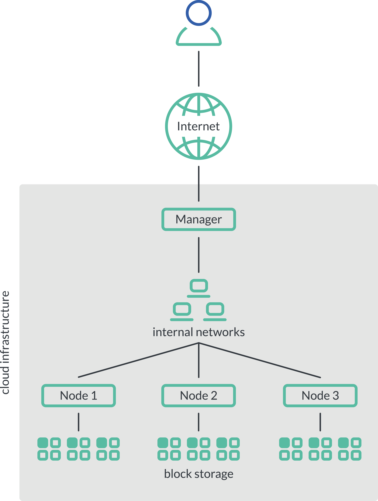
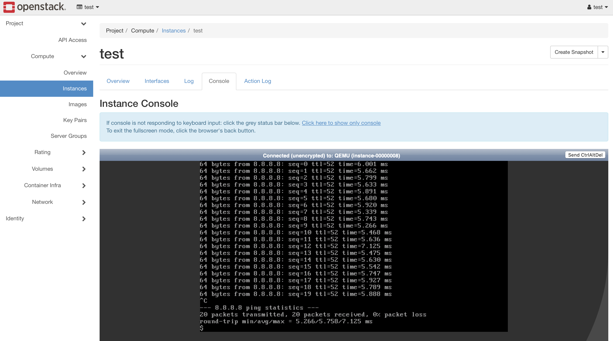

# Overview

<!---**ToDo**: Image/Map SCS context-->

With this testbed, it is possible to run a full OSISM installation, the baseline of the Sovereign Cloud Stack, on an existing
OpenStack environment such as Cleura or Open Telekom Cloud. If you are looking for the full installation, head over to here:
<https://docs.osism.tech/>

The testbed is intended as a playground. Further services and integration will be added over time. More and more best practices
and experiences from the productive installations will be included here in the future. It will become more production-like over
time. However, at no point does it claim to represent a production exactly.

The section [How to contribute](./contribute.md) describes how to contribute to this testbed. Open Source Software lives from
participation. We welcome any issues, change requests or general feedback. Do not hestiate to open an issue.

For the German-speaking readers, [iX 2020/12](https://www.osism.tech/files/ix.2020.12.048_059.pdf_kiosk.pdf) contains an article
by Kurt Garloff titled [Wolken-Verbund](https://www.osism.tech/files/ix.2020.12.048_059.pdf_kiosk.pdf), in which, among other
things, the OSISM testbed is briefly introduced.

## Structure and composition of a Testbed

By default the testbed consists of a manager and three HCI nodes, each with three block devices.
The manager serves as a central entry point into the environment.

The virtual testbed provides an up-to-date, fully functional Ceph and OpenStack environment. It is possible to evaluate
workloads like Kubernetes on the basis of this virtual testbed.

## Supported releases

The following stable Ceph and OpenStack releases are supported. The development branch usually works too.

### Ceph

The deployment of Ceph is based on [ceph-ansible](https://github.com/ceph/ceph-ansible).

* Luminous
* Nautilus
* Octopus
* Pacific (**default**)
* Quincy

### OpenStack

The deployment of OpenStack is based on [kolla-ansible](https://opendev.org/openstack/kolla-ansible).

* Rocky
* Stein
* Train
* Ussuri
* Victoria
* Wallaby
* Xena
* Yoga (**default**)

## Software Bill Of Materials (SBOM)

The following services can currently be used with this testbed without further adjustments.

### Infrastructure

* Ceph
* Elasticsearch
* Etcd
* Fluentd
* Gnocchi
* Grafana
* Haproxy
* Influxdb
* Keepalived
* Keycloak
* Kibana
* Mariadb
* Memcached
* Netbox
* Netdata
* Openvswitch
* Patchman
* Prometheus exporters
* Rabbitmq
* Redis
* Skydive

### OpenStack

* Aodh
* Barbican
* Ceilometer
* Cinder
* Glance
* Heat
* Horizon
* Ironic
* Keystone
* Manila
* Neutron
* Nova (with KVM)
* Octavia
* Panko
* Senlin
