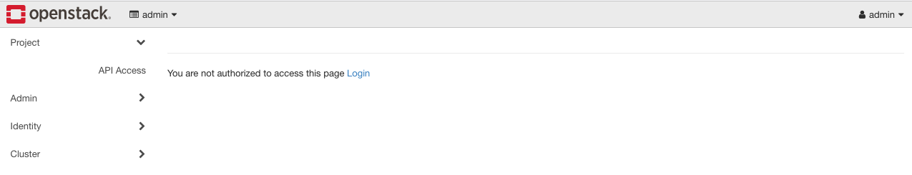
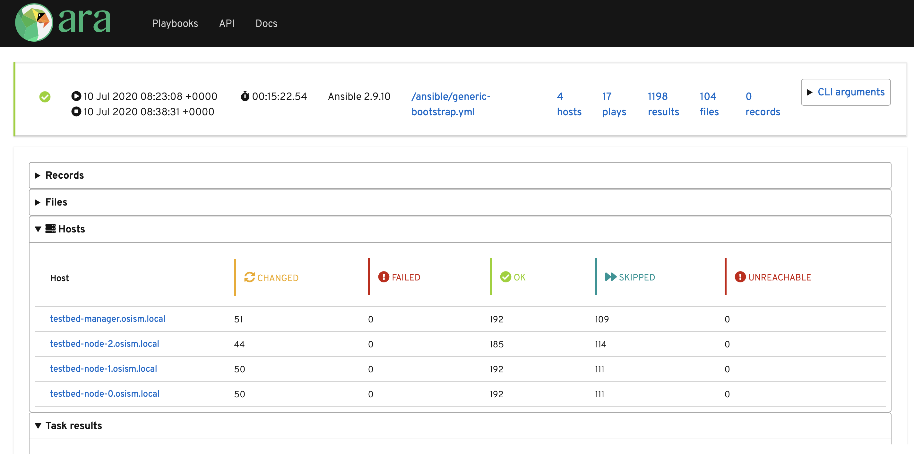
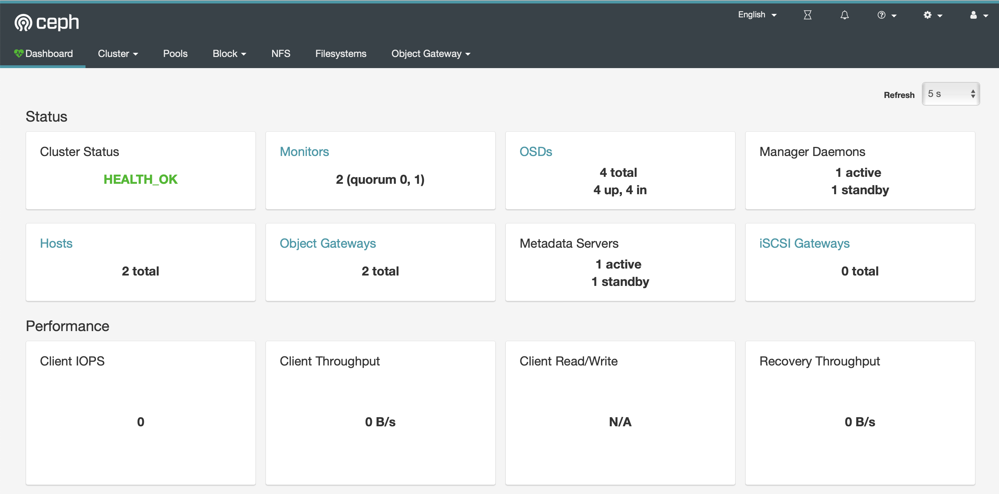
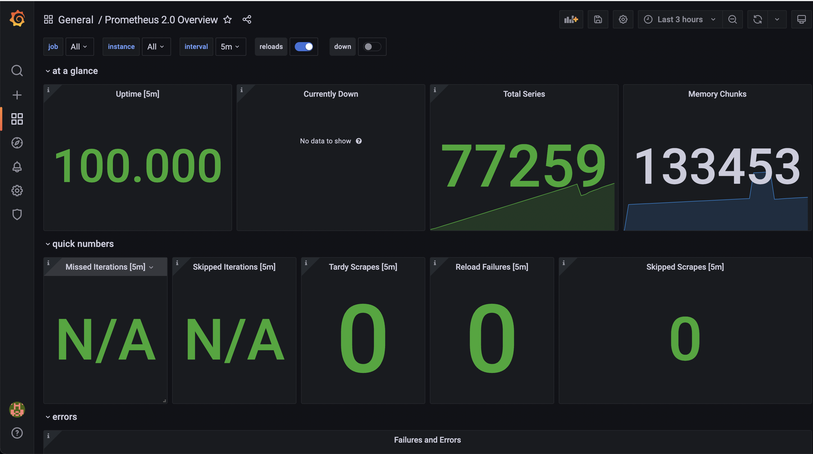
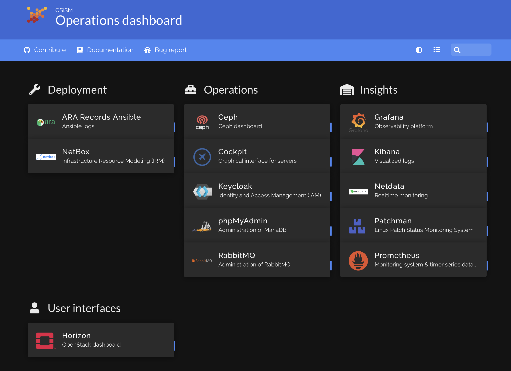
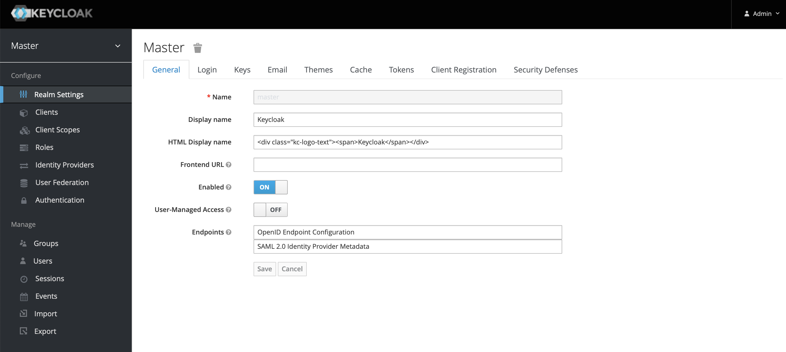
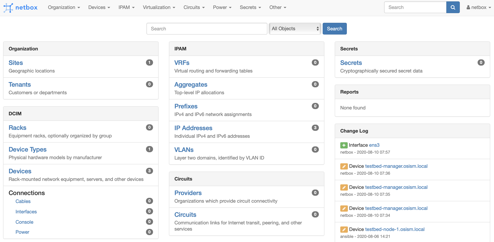
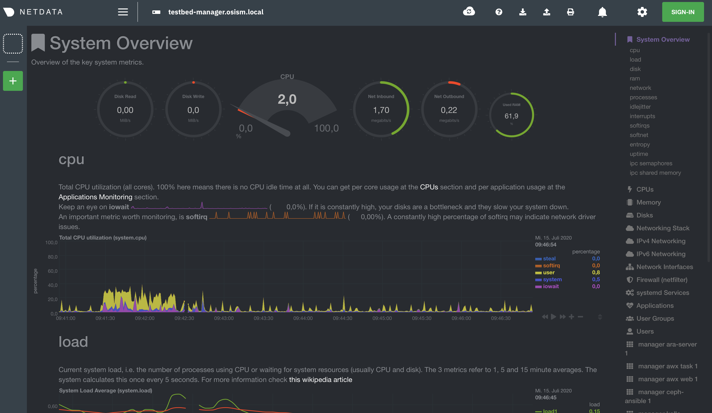
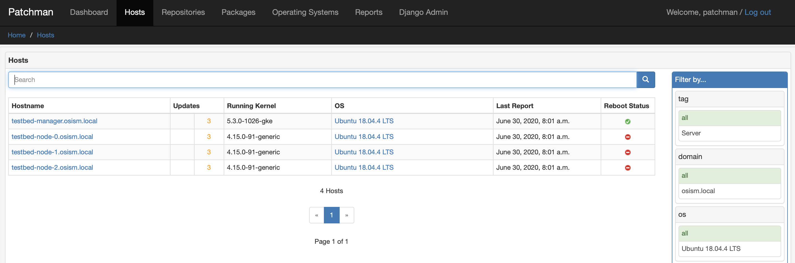

# Working with the Testbed

## Infrastructure management

:::note

> The following commands are executed from the **testbed/terraform** repository directory.

:::

Get the URL for the VNC console from an instance (by default from the manager):

```sh
make console ENVIRONMENT=regiocloud
make console ENVIRONMENT=regiocloud CONSOLE=node-0
```

Get the console log from an instance (by default from the manager):

```sh
make log ENVIRONMENT=regiocloud
make log ENVIRONMENT=regiocloud CONSOLE=node-0
```

Open a login shell on the manager via SSH:

```sh
make ssh ENVIRONMENT=regiocloud
make login ENVIRONMENT=regiocloud  # this is just an alias for "make ssh"
```

Create a tunnel for the internal networks (**192.168.16.0/20**,  **192.168.112.0/20**) via sshuttle
<https://github.com/sshuttle/sshuttle>:

```sh
make sshuttle ENVIRONMENT=regiocloud
make tunnel ENVIRONMENT=regiocloud   # this is just an alias for "make sshuttle"
```

Show endpoint URLs (ara, phpmyadmin):

```sh
make endpoints ENVIRONMENT=regiocloud
```

Show manager address:

```sh
make address ENVIRONMENT=regiocloud
```

Open an Openstack Client Console:

```sh
make openstack ENVIRONMENT=regiocloud
```

Copy a file to the manager:

```sh
make scp PARAMS=/file/to/be/copied SOURCE=/path/to/destination ENVIRONMENT=regiocloud
make copy PARAMS=/file/to/be/copied SOURCE=/path/to/destination ENVIRONMENT=regiocloud # this is just an alias for "make scp"
```

### Terraform

Delete providers:

```sh
make reset ENVIRONMENT=regiocloud
```

Init terraform, select workspace and copy override and custom files:

```sh
make init ENVIRONMENT=regiocloud
```

Init terraform and validate:

```sh
make validate ENVIRONMENT=regiocloud
```

Init terraform and import a resource:

```sh
make attach ENVIRONMENT=regiocloud
```

Init terraform and remove a resource:

```sh
make detach ENVIRONMENT=regiocloud
```

Init terraform and push a state to a remote backend:

```sh
make state-push ENVIRONMENT=regiocloud
make push ENVIRONMENT=regiocloud       # this is just an alias for "make state-push"
```

Init terraform and generate a graph in DOT format:

```sh
make graph ENVIRONMENT=regiocloud
```

Init terraform and show the current state:

```sh
make show ENVIRONMENT=regiocloud
```

Init terraform and show the configuration of a specific resource:

```sh
make list ENVIRONMENT=regiocloud
```

Decommissioning:

```sh
make clean ENVIRONMENT=regiocloud
```

[](https://asciinema.org/a/9YR0fAukUitMlryGKlexWz17k)

### Checks

Most of the checks require a full installation of OpenStack and Ceph.
Only **ping** works without them.

Check the installation via ping:

```sh
make ping ENVIRONMENT=regiocloud
```

Run check script for openstack and infrastructure components:

```sh
make check ENVIRONMENT=regiocloud
```

Run rally script (benchmark openstack):

```sh
make rally ENVIRONMENT=regiocloud
```

Run refstack script:

```sh
make refstack ENVIRONMENT=regiocloud
```

### Internals

These are used for make internal functions and not supposed to be used by a user:

```sh
make .deploy.$(ENVIRONMENT)          # check if a deployment is present
make .MANAGER_ADDRESS.$(ENVIRONMENT) # return manager address
make .id_rsa.$(ENVIRONMENT)          # write private key
```

## Wireguard

* deployment

```sh
osism apply wireguard
```

* client configuration can be found in **/home/dragon/wireguard-client.conf** on **testbed-manager**,
  **MANAGER_PUBLIC_IP_ADDRESS** has to be replaced by the public address of **testbed-manager**

## Change versions

* Go to **/opt/configuration** on the manager node
* Run **./scripts/set-openstack-version.sh zed** to set the OpenStack version to **zed**
* Run **./scripts/set-ceph-version.sh quincy** to set the Ceph version to **quincy**
* Go to **/home/dragon** on the manager node
* Run **ansible-playbook manager-part-2.yml** to update the manager

This can also be achieved automatically by passing the wanted versions inside the environment **ceph_version** and
**openstack_version** respectively.

## Deploy service

On the testbed, the services can currently be deployed manually. In the future, these manual steps will be automated by Zuul CI.

* Basic Ceph services

```sh
/opt/configuration/scripts/deploy/100-ceph-services-basic.sh
```

* Extended Ceph services (RGW + MDS)

```sh
/opt/configuration/scripts/deploy/110-ceph-services-extended.sh
```

* Basic infrastructure services (MariaDB, RabbitMQ, Redis, ...)

```sh
/opt/configuration/scripts/deploy/200-infrastructure-services-basic.sh
```

* Extended infrastructure services (Patchman, phpMyAdmin, ...)

```sh
/opt/configuration/scripts/deploy/210-infrastructure-services-extended.sh
```

* Basic OpenStack services (Compute, Storage, ...)

```sh
/opt/configuration/scripts/deploy/300-openstack-services-basic.sh
```

* Extended OpenStack services (Telemetry, Kubernetes, ...)

```sh
/opt/configuration/scripts/deploy/310-openstack-services-extended.sh
```

* Baremetal OpenStack service

```sh
/opt/configuration/scripts/deploy/320-openstack-services-baremetal.sh
```

* Additional OpenStack services (Rating, Container, ...)

```sh
/opt/configuration/scripts/deploy/330-openstack-services-additional.sh
```

* Monitoring services (Netdata, Prometheus exporters, ...)

```sh
/opt/configuration/scripts/deploy/400-monitoring-services.sh
```

## Update services

* Ceph services

```sh
/opt/configuration/scripts/upgrade/100-ceph-services.sh
```

* Basic infrastructure services (MariaDB, RabbitMQ, Redis, ...)

```sh
/opt/configuration/scripts/upgrade/200-infrastructure-services-basic.sh
```

* Basic OpenStack services (Compute, Storage, ...)

```sh
/opt/configuration/scripts/upgrade/300-openstack-services-basic.sh
```

* Baremetal OpenStack service

```sh
/opt/configuration/scripts/upgrade/320-openstack-services-baremetal.sh
```

## Upgrade services

For an upgrade, the manager itself is updated first. Set the **manager_version** argument in
**environments/manager/configuration.yml** to the new version and execute **osism-update-manager** afterwards.

The upgrade of the services is then done in the same way as the update of the services.
Simply re-run the scripts listed in [Udate services](#update-services).

:::note

> When upgrading from a rolling release (**latest**, **xena**, ..) to a stable release (**3.2.0**, **4.0.0**, ..), it is important
> to remove the parameters **ceph_version** and **openstack_version** from  **environments/manager/configuration.yml**. For a
> stable release, the versions of Ceph and OpenStack to use are set by the version of the stable release (set via the
> **manager_version** parameter) and not by release names.

:::

## Purge services

These commands completely remove parts of the environment. This makes reuse possible without having to create a completely new
environment.

### OpenStack & infrastructure services

```sh
osism-kolla _ purge
Are you sure you want to purge the kolla environment? [no]: yes
Are you really sure you want to purge the kolla environment? [no]: ireallyreallymeanit
```

### Ceph

```sh
find /opt/configuration -name 'ceph*keyring' -exec rm {} \;
osism-ceph purge-docker-cluster
Are you sure you want to purge the cluster? Note that if with_pkg is not set docker
packages and more will be uninstalled from non-atomic hosts. Do you want to continue?
 [no]: yes
```

### Manager services

```sh
cd /opt/manager
docker compose down -v
```

Some services like phpMyAdmin or OpenStackClient will still run afterwards.

## Webinterfaces

:::note

> All SSL enabled services within the testbed use certs which are signed by the self-signed
> [OSISM Testbed CA](https://raw.githubusercontent.com/osism/testbed/main/environments/kolla/certificates/ca/testbed.crt)

:::

Name                   | URL                                               | Username      | Password
-----------------------|---------------------------------------------------|---------------|---------
ARA                    | <https://ara.testbed.osism.xyz/>                  | ara           | password
Ceph                   | <https://api-int.testbed.osism.xyz:8140>          | admin         | password
Flower                 | <https://api-int.testbed.osism.xyz:8140>          |               |
Grafana                | <https://api-int.testbed.osism.xyz:3000>          | admin         | password
Homer                  | <https://homer.testbed.osism.xyz>                 |               |
Horizon (via Keystone) | <https://api.testbed.osism.xyz>                   | admin         | password
Horizon (via Keystone) | <https://api.testbed.osism.xyz>                   | test          | test
Horizon (via Keycloak) | <https://api.testbed.osism.xyz>                   | alice         | password
Keycloak               | <https://keycloak.testbed.osism.xyz>              | admin         | password
Kibana                 | <https://api.testbed.osism.xyz:5601>              | kibana        | password
Netbox                 | <https://netbox.testbed.osism.xyz/>               | admin         | password
Netdata                | <https://testbed-manager.testbed.osism.xyz:19999> |               |
Patchman               | <https://patchman.testbed.osism.xyz/>             | patchman      | password
Prometheus             | <https://api-int.testbed.osism.xyz:9091/>         |               |
phpMyAdmin             | <https://phpmyadmin.testbed.osism.xyz>            | root          | password
RabbitMQ               | <https://api-int.testbed.osism.xyz:15672/>        | openstack     | BO6yGAAq9eqA7IKqeBdtAEO7aJuNu4zfbhtnRo8Y

:::note

> To access the webinterfaces, make sure that you have a tunnel up and running for the internal networks.
>
> ```sh
> make sshuttle ENVIRONMENT=regiocloud
> ```

:::

:::note

> If only the identity services were deployed, an error message (**You are not authorized to access this page**)
> appears after logging in to Horizon. This is not critical and results from the absence of the Nova service.
> 

:::

### ARA



### Ceph

Deploy *Ceph* first.

```sh
osism apply bootstraph-ceph-dashboard
```



### Grafana



### Homer

```sh
osism apply homer
```



### Keycloak

```sh
osism apply keycloak
```



### Netbox

Netbox is part of the manager and does not need to be deployed individually.



### Netdata

```sh
osism apply netdata
```



### Patchman

```sh
osism apply patchman-client
osism apply patchman
```

Every night the package list of the clients is transmitted via cron. Initially we transfer these lists manually.

```sh
osism-ansible generic all -m command -a patchman-client
```

After the clients have transferred their package lists for the first time the database can be built by Patchman.

This takes some time on the first run. Later, this update will be done once a day during the night via cron.

```sh
patchman-update
```

The previous steps can also be done with a custom playbook.

```sh
osism apply bootstrap-patchman
```



### Prometheus exporters

Deploy *Clustered infrastructure services*, *Infrastructure services*, and *Basic OpenStack services* first.

```sh
osism apply prometheus
```

## Tools

### Rally

```sh
/opt/configuration/contrib/rally/rally.sh
[...]
Full duration: 6.30863

HINTS:
* To plot HTML graphics with this data, run:
    rally task report 002a01cd-46e7-4976-940f-943586771629 --out output.html

* To generate a JUnit report, run:
    rally task export 002a01cd-46e7-4976-940f-943586771629 --type junit-xml --to output.xml

* To get raw JSON output of task results, run:
    rally task report 002a01cd-46e7-4976-940f-943586771629 --json --out output.json

At least one workload did not pass SLA criteria.
```

### Refstack

```sh
/opt/configuration/contrib/refstack/run.sh
[...]
======
Totals
======
Ran: 286 tests in 1197.9323 sec.
 - Passed: 284
 - Skipped: 2
 - Expected Fail: 0
 - Unexpected Success: 0
 - Failed: 0
Sum of execute time for each test: 932.9678 sec.
```

### Check infrastructure services

The contrib directory contains a script to check the clustered infrastructure services. The configuration is so that two nodes
are already sufficient.

```sh
cd /opt/configuration/contrib
./check_infrastructure_services.sh
Elasticsearch   OK - elasticsearch (kolla_logging) is running. status: green; timed_out: false; number_of_nodes: 2; ...

MariaDB         OK: number of NODES = 2 (wsrep_cluster_size)

RabbitMQ        RABBITMQ_CLUSTER OK - nb_running_node OK (2) nb_running_disc_node OK (2) nb_running_ram_node OK (0)

Redis           TCP OK - 0.002 second response time on 192.168.16.10 port 6379|time=0.001901s;;;0.000000;10.000000
```

### Random data

The contrib directory contains some scripts to fill the components of the environment with random data. This is intended to
generate a realistic data load, e.g. for upgrades or scaling tests.

#### MySQL

After deployment of MariaDB including HAProxy it is possible to create four test databases each with four tables which are
filled with randomly generated data. The script can be executed multiple times to generate more data.

```sh
cd /opt/configuration/contrib
./mysql_random_data_load.sh 100000
```

#### Elasticsearch

After deployment of Elasticsearch including HAProxy it is possible to create 14 test indices which are filled with randomly
generated data. The script can be executed multiple times to generate more data.

14 indices are generated because the default retention time for the number of retained indices is set to 14.

```sh
cd /opt/configuration/contrib
./elasticsearch_random_data_load.sh 100000
```

## Recipes

This section describes how individual parts of the testbed can be deployed.

* Ceph

```sh
osism apply ceph-mons
osism apply ceph-mgrs
osism apply ceph-osds
osism apply ceph-mdss
osism apply ceph-crash
osism apply ceph-rgws
osism apply copy-ceph-keys
osism apply cephclient
```

* Clustered infrastructure services

```sh
osism apply common
osism apply loadbalancer
osism apply elasticsearch
osism apply rabbitmq
osism apply mariadb
```

* Infrastructure services (also deploy *Clustered infrastructure services*)

```sh
osism apply openvswitch
osism apply ovn
osism apply memcached
osism apply kibana
```

* Basic OpenStack services (also deploy *Infrastructure services*, *Clustered infrastructure services*, and *Ceph*)

```sh
osism apply keystone
osism apply horizon
osism apply placement
osism apply glance
osism apply cinder
osism apply neutron
osism apply nova
osism apply openstackclient
osism apply bootstrap-basic
```

* Additional OpenStack services (also deploy *Basic OpenStack services* and all requirements)

```sh
osism apply heat
osism apply gnocchi
osism apply ceilometer
osism apply aodh
osism apply barbican
osism apply designate
osism apply octavia
```
